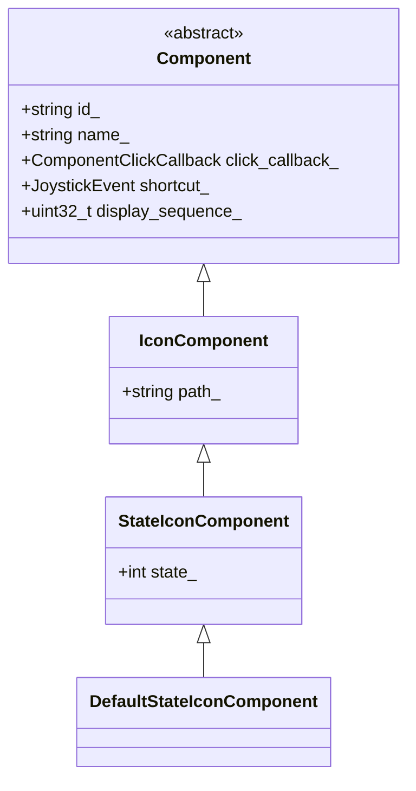

# Booster Agent Framework

A C++ framework for building interactive Booster agents.

## [What is Booster Agent](docs/booster_agent_101.md)?

## Features

- **Component System**: Hierarchical UI component management with different types (Icon, StateIcon, DefaultStateIcon)
- **Joystick Integration**: Comprehensive joystick event handling with key combinations and shortcuts
- **Internationalization**: Built-in support for multi-language UI elements with JSON serialization
- **ROS2 Integration**: Native ROS2 node with service interfaces and publishers
- **Event-Driven Architecture**: Component click callbacks and joystick event routing
- **JSON Protocol**: Built-in JSON message protocol for communication with App clients
- **Service-based Communication**: RESTful-like service interfaces for component interactions

## Quick Start

### 1. Include Headers

```cpp
#include "agent_node.hpp"
```

### 2. Create Your Agent

```cpp
class MyAgent : public booster_agent_framework::AgentNode {
public:
    MyAgent(const std::string& agent_id) : AgentNode(agent_id) {
        setup_ui_components();
    }
    
private:
    void setup_ui_components() {
        // Create localized component names
        LocaleString name({{"en", "Start"}, {"zh", "开始"}});
        
        // Create component with callback
        auto component = std::make_shared<IconComponent>(
            "start", name, "/path/to/icon.png",
            [](const Component& comp) -> OptionalToast {
                return LocaleString({{"en", "Started!"}, {"zh", "已启动!"}});
            },
            JoystickEvent::create_event(JoystickEventType::BUTTON_DOWN, {JoystickKey::A})
        );
        
        get_component_mgr().add_component(component);
    }
};
```

### 3. Run Your Agent

```cpp
int main(int argc, char** argv) {
    rclcpp::init(argc, argv);
    auto agent = std::make_shared<MyAgent>("my_unique_agent_id");
    rclcpp::spin(agent);
    rclcpp::shutdown();
    return 0;
}
```

## Core concepts
### Component


## Core Classes

### AgentNode
Base class for all agents providing:
- ROS2 node functionality with unique agent ID
- Component management through ComponentMgr
- Service interfaces for general requests and joystick events
- Message publishing to App clients via broadcast topic
- Automatic service/topic name generation based on agent ID

### Component Hierarchy
- `Component`: Base class with ID, name, click callback, and joystick shortcut
- `IconComponent`: Adds icon path for visual representation  
- `StateIconComponent`: Adds integer state management with JSON serialization
- `DefaultStateIconComponent`: Boolean state for simple on/off components

All components support:
- Automatic JSON serialization with `to_json()` method
- Localized names with language-specific content
- Joystick shortcuts for accessibility
- Display sequence ordering

### JoystickEvent
Represents joystick input events with:
- Event type (button press/release, axis motion, etc.)
- Key combinations as bitmasks
- Analog stick positions
- String representation for debugging

### LocaleString  
Internationalization support:
- Multi-language text storage
- Automatic fallback to default language
- JSON serialization for protocol messages
- Easy integration with UI components

## Component Types

### Icon Component
Simple clickable icon with image path:

```cpp
auto icon = std::make_shared<IconComponent>(
    "my_icon", 
    LocaleString("My Icon"),
    "/path/to/icon.png",
    callback_function
);
```

### State Icon Component  
Icon with integer state (useful for multi-state toggles):

```cpp
auto state_icon = std::make_shared<StateIconComponent>(
    "state_icon",
    LocaleString("State Icon"), 
    "/path/to/icon.png",
    0, // Initial state
    callback_function
);
```

### Default State Icon Component
Icon with boolean state (simple on/off):

```cpp
auto toggle = std::make_shared<DefaultStateIconComponent>(
    "toggle",
    LocaleString("Toggle"),
    "/path/to/icon.png", 
    false, // Initially off
    callback_function
);
```

## Joystick Events

### Creating Events
```cpp
// Single key
auto event = JoystickEvent::create_event(
    JoystickEventType::BUTTON_DOWN, 
    {JoystickKey::A}
);

// Key combinations
auto combo = JoystickEvent::create_event(
    JoystickEventType::BUTTON_DOWN,
    {JoystickKey::LB, JoystickKey::A}
);
```

### Checking Keys
```cpp
if (event.has_key(JoystickKey::A)) {
    // A button is pressed
}
```

### Available Keys
- Face buttons: `A`, `B`, `X`, `Y`
- Triggers: `LT`, `RT` 
- Bumpers: `LB`, `RB`
- Stick clicks: `LS`, `RS`
- D-pad: `HAT_UP`, `HAT_DOWN`, `HAT_LEFT`, `HAT_RIGHT`, etc.

## Internationalization

### Creating Localized Strings
```cpp
// Single language
LocaleString simple("Hello World");

// Multiple languages  
LocaleString multi({
    {"en", "Hello World"},
    {"zh", "你好世界"},
    {"es", "Hola Mundo"}
});
```

### Using Localized Strings
```cpp
std::string text = multi.get_string("zh"); // Returns "你好世界"
std::string fallback = multi.get_string("fr"); // Returns English fallback
```

## JSON Protocol Communication

The framework uses a structured JSON protocol for communication with App clients:

### Component Management Messages
Components are automatically serialized to JSON when published:

```cpp
// Components generate JSON like:
{
  "id": "my_component",
  "type": "icon_component",
  "locale_name": {"en": "My Component", "zh": "我的组件"},
  "icon_resource_path": "/path/to/icon.png"
}
```

### Service Request Format
The framework handles service requests in this format:

```json
{
  "language": "en",
  "agent_req": {
    "event": "on_component_click",
    "component_id": "start_button",
    "state": 1
  }
}
```

### Publishing Messages
Use `publish_message()` to send custom messages to App clients:

```cpp
json custom_message;
custom_message["type"] = "status_update";
custom_message["data"] = "System initialized";
publish_message(custom_message);
```

## ROS2 Integration

### Service Interfaces
Each agent creates two ROS2 services:

1. **General Service**: `/booster/agent/{agent_id}/service`
   - Handles component click events and UI queries
   - Uses `AgentService` message type from the protocol package

2. **Joystick Service**: `/booster/agent/{agent_id}/joystick` 
   - Handles joystick/controller input events
   - Uses `AgentJoyService` message type from the protocol package

### Publisher
Each agent publishes to: `/booster/agent/event_broadcast`
- Uses `AgentState` message type 
- Publishes component updates and toast messages
- QoS depth of 1 for latest message delivery

### Callback Groups
The framework uses separate callback groups for thread safety:
- `_general_server_cb_group`: MutuallyExclusive for service calls
- `_joystick_server_cb_group`: MutuallyExclusive for joystick events  
- `_publish_client_cb_group`: Reentrant for publishing operations

## Building

### Prerequisites
- ROS2 (Humble or later)
- C++17 compatible compiler
- CMake 3.8+

### Build Commands
```bash
cd your_workspace
colcon build --packages-select agent_node
```

## Examples

See `examples/example_agent.cpp` for a complete working example demonstrating:
- Component creation and management
- Joystick event handling
- Internationalization
- State management
- Toast notifications
- JSON protocol usage

## Testing

### Service Testing
Use `ros2 service call` to test agent services:

```bash
# Test general service
ros2 service call /booster/agent/my_agent_id/service \
  booster_agent_framework_protocol/srv/AgentService \
  "{request_body: '{\"agent_req\":{\"event\":\"get_agent_ui_component_list\"}}'}"

# Test joystick service  
ros2 service call /booster/agent/my_agent_id/joystick \
  booster_agent_framework_protocol/srv/AgentJoyService \
  "{controller_state: {event: 1603, a: true}}"
```

### Topic Monitoring
Monitor agent messages:

```bash
ros2 topic echo /booster/agent/event_broadcast
```

## API Reference

Detailed API documentation is available in the header files with Doxygen comments. Generate documentation with:

```bash
doxygen Doxyfile
```

## License
Apache License 2.0
